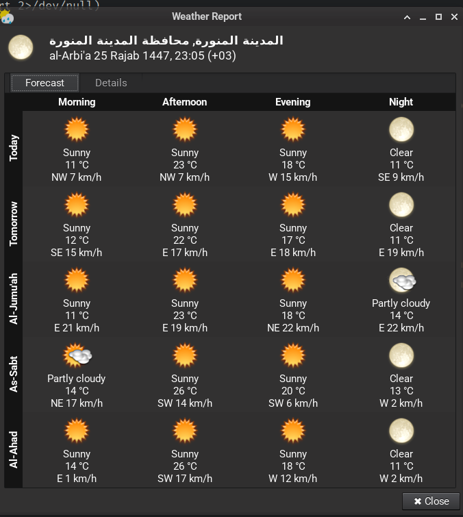

# XFCE4 Weather Plugin - Hijri Edition

A fork of the official XFCE4 Weather Plugin with **Hijri (Islamic) calendar** support and **Arabic day names**.



## Features

- **Hijri calendar date** displayed in the header (e.g., "25 Rajab 1447")
- **Arabic day names** in transliteration:
  - Today / Tomorrow for the first two days
  - Al-Jumu'ah (Friday)
  - As-Sabt (Saturday)
  - Al-Ahad (Sunday)
  - Al-Ithnayn (Monday)
  - Ath-Thulatha (Tuesday)
  - Al-Arbi'a (Wednesday)
  - Al-Khamis (Thursday)
- All original features of xfce4-weather-plugin

## Who is this for?

This plugin is designed for **Muslims using Linux with XFCE desktop** who want to see the Hijri date alongside weather information.

## Installation

### Dependencies

```bash
# Arch/Artix
sudo pacman -S libxml2 libsoup3 upower meson ninja gtk3 libxfce4ui xfce4-panel

# Debian/Ubuntu
sudo apt install libxml2-dev libsoup-3.0-dev libupower-glib-dev meson ninja-build libgtk-3-dev libxfce4ui-2-dev xfce4-panel-dev
```

### Build & Install

```bash
git clone https://github.com/A-Levin/xfce4-weather-plugin-hijri.git
cd xfce4-weather-plugin-hijri
meson setup build --prefix=/usr
meson compile -C build
sudo meson install -C build
```

### Restart panel

```bash
xfce4-panel -r
```

## Uninstall

```bash
cd xfce4-weather-plugin-hijri/build
sudo ninja uninstall
```

Then reinstall the original plugin from your distribution's package manager.

## Credits

- Original plugin: [XFCE Team](https://gitlab.xfce.org/panel-plugins/xfce4-weather-plugin)
- Weather data: [met.no](https://api.met.no/)
- Hijri calendar integration: Abdullah Levin

## License

GPL-2.0-or-later (same as the original plugin)
